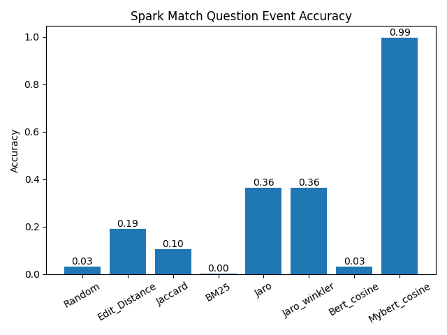

# LogReasoning
## Pipline
1. 训练问题-事件匹配模型: python model.py 

 \
2. 保存每个事件对应的embedding: python bert_embedding.py
3. 评估问题-事件匹配模型的的结果: python match_question_event.py
4. 根据每个问题匹配的事件, 过滤原始logs, 保存过滤后的QA结果 

| Rule-based      | Accuracy |
| :----------- | :----------- | 
| Spark      | 0.904 |

| DistilBert      | Accuracy |
| :----------- | :----------- |
| Spark      | 0.600 |

4. 训练QANet提取事件中答案的位置: cd QANet-pytorch-/ python main.py --mode data   python main.py --mode train
5. 评估QANet的结果，并保存每个问题对应答案在日志事件中的位置: cd QANet-pytorch-/ python main.py --mode test
6. 根据4、5的结果提取问题的答案: python extract_answer.py (TO DO)
7. 根据问题判断应该进行的计算: python judge_question.py (TO DO)

|    Method  | F1 | EM  |
| :----------- | :----------- | :----------- |
| LogReasoning(Rule-based)       | 0.739 | 0.739 |
| LogReasoning(Rule-based)       | 0.529 | 0.529 |
